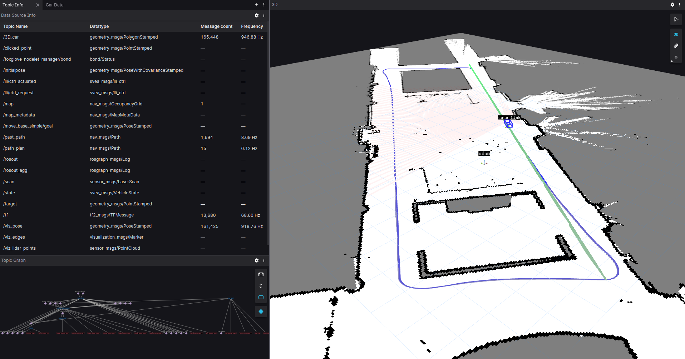

# SVEA Starter Suite

### Quicklinks:
- [SVEA website](https://svea.eecs.kth.se)
- [SVEA Docs](https://kth-sml.github.io/svea)
- [Tutorials](https://kth-sml.github.io/svea/tutorials/0_intro)
- [Sim to Real Tips](https://github.com/KTH-SML/svea#going-from-simulation-to-real)
- [Testing](https://github.com/KTH-SML/svea#testing)

## A short description
This repo contains a basic library of python objects and scripts to make
development on the Small-Vehicles-for-Autonomy (SVEA) platform simpler
and cleaner.

The design principle of this library is to help create projects that are
more modular and easier to troubleshoot. As opposed to the standard
approach of creating a large web of Subscriber/Publisher nodes, we modularly
wrap different ROS entities in Python objects, while exposing only the useful
features with object-oriented interfaces.

## Useful to know before starting
Before continuing to the next sections, consider taking some time to read up on
two important concepts for this code base: the **Robotic Operating System (ROS)**
and **Object Oriented Programming (OOP)**.

To read up on ROS, check out the
[ROS Start Guide](http://wiki.ros.org/ROS/StartGuide). However, do not spend
too much time diving into the guide. The structure and tutorials are not very
intuitive, but glossing over them will give a sense of what ROS is and how you
are meant to use it. The rest of the learning curve is overcome by trying it out
yourself.

To read up on OOP, check out Real Python's
[introduction on OOP](https://realpython.com/python3-object-oriented-programming/).

# Installation

In the instructions below, we describe the system requirements, installation
process, and run instructions using Docker. If you want to set up this code
base natively, then check out our [Building the SVEA Stack Natively](docs/development/native_build.md)
instructions.

## Install Docker Engine
For the instructions below to work, you need to first install Docker Engine.

For Windows users, you will need to first install WSL 2 and set it's distribution to
Ubuntu (either 18 or 20). Use the commands listed [here](https://learn.microsoft.com/en-us/windows/wsl/basic-commands)
to "Install", "List available Linux distributions", and "Set default WSL Version" to
Ubuntu 18 or 20.

To install Docker Engine, follow the instructions for your operating system
[here](https://docs.docker.com/engine/).

## Installing the Docker image
Start by going to the folder where you want the code to reside.
For example, choose the home directory or a directory for keeping projects in.
Once you are in the chosen directory, use the command:

```bash
git clone https://github.com/KTH-SML/svea
```

to download the library. Then, a new directory will appear called
`./svea`. Go into the directory with command:

```bash
cd svea
```

To install the Docker image containing the entire codebase run:

```bash
util/build
```

If it all runs without an error, you have installed the Docker image!

## Installing Foxglove Studio
Although this code base supports matplotlib and rviz, the main visualization
tool used is Foxglove Studio. To install Foxglove Studio, follow the instructions
for your operating system [here](https://foxglove.dev/download)

**Note**: alternatively, you can use the Web version of Foxglove Studio which is
also available from the installation link.

# Usage
The intended workflow with the code base is as follows:
1. Write new features/software
2. Debug the new contributions in simulation
3. Perform basic tuning and adjustments in simulation
4. Evaluate actual performance on a SVEA car

The simulated vehicles provide identical interfaces and information patterns
to the real SVEA cars, thus by following this workflow, development work
should always start in simulation and code can be directly ported to the real
cars. However, this does not mean the code will work on a
real vehicle without further tuning or changes.

There are pre-written scripts to serve as examples of how to use the
core library. See and read the source code in
`svea_examples/scripts`.

Start by entering into the installed Docker image by going to the root of `svea`
and running

```bash
util/run-dev
```

Then, for a simulated, pure pursuit example, call:

```bash
roslaunch svea_examples floor2.launch
```

Then, open Foxglove Studio natively or in the browser, and on the first prompt
click "Open connection", then click "Open" with the default settings. Next,
click on the "Layout" dropdown menu and select "Import from file...". Finally,
navigate to `svea/foxglove` and select `Floor2 Pure Pursuit.json`. After it
finishes loading, you should see something that looks like this:



Now you are ready to read through the tutorials! You can find them
[here](https://kth-sml.github.io/svea/tutorials/0_intro).

## Going from simulation to real

**Note, you only have to follow this section when running the real cars!**

### Adding the low-level interface

To your roslaunch file, add

```xml
<!--open serial connection for controlling SVEA-->
<node pkg="rosserial_python" type="serial_node.py" name="serial_node">
    <param name="port" value="/dev/ttyACM0"/>
    <param name="baud" value="250000"/>
</node>
```

### Running localization on the real SVEA

Running the localization amounts to adding `localize.launch` to your project launch:

```xml
<include file="$(find svea_sensors)/launch/localize.launch"/>
```

### Using priviliged run script

Instead of using `util/run-dev`, which is intended for development environments
and simulation, to access all hardware on the real SVEA you must start
a container with the priviliged run script:

```bash
util/run
```

# Documentation
After cloning the repository, you can open the core library's documentation by opening `docs/library/_build/index.html` in your favorite browser.

