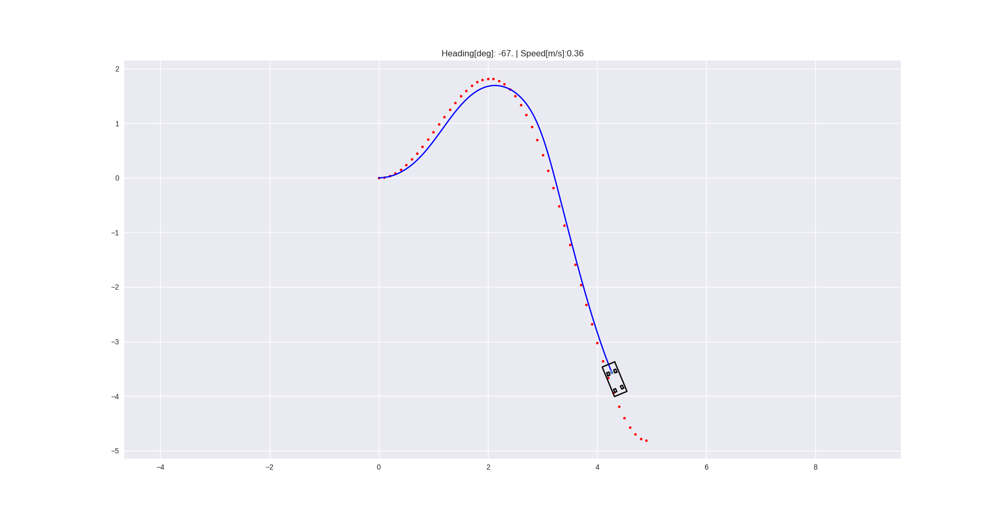
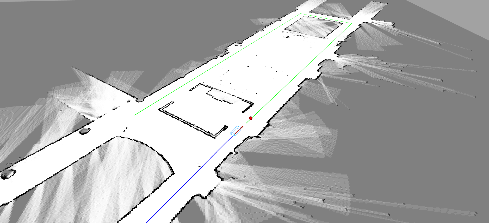

# SVEA Starter Suite

### Quicklinks:
- [SVEA website](https://svea.eecs.kth.se)
- [Tutorials](https://github.com/KTH-SML/svea/tree/main/docs/tutorials)
- [Sim to Real Tips](https://github.com/KTH-SML/svea#going-from-simulation-to-real)
- [Testing](https://github.com/KTH-SML/svea#testing)

## A short description
This repo contains a basic library of python objects and scripts to make
development on the Small-Vehicles-for-Autonomy (SVEA) platform simpler
and cleaner.

The design principle of this library is to help create projects that are
more modular and easier to troubleshoot. As opposed to the standard
approach of creating a large web of Subscriber/Publisher nodes, we modularly
wrap different ROS entities in Python objects, while exposing only the useful
features with object-oriented interfaces.

## Useful to know before starting
Before continuing to the next sections, consider taking some time to read up on
two important concepts for this code base: the **Robotic Operating System (ROS)**
and **Object Oriented Programming (OOP)**.

To read up on ROS, check out the
[ROS Start Guide](http://wiki.ros.org/ROS/StartGuide). However, do not spend
too much time diving into the guide. The structure and tutorials are not very
intuitive, but glossing over them will give a sense of what ROS is and how you
are meant to use it. The rest of the learning curve is overcome by trying it out
yourself.

To read up on OOP, check out Real Python's
[introduction on OOP](https://realpython.com/python3-object-oriented-programming/).

# Installation

## System Requirements
This library is developed on and intended for systems running:

1. Ubuntu 20.04 (installation tutorial [here](https://ubuntu.com/tutorials/tutorial-install-ubuntu-desktop#1-overview))
2. ROS Noetic (installation instructions [here](http://wiki.ros.org/noetic/Installation/Ubuntu))

If you do not want to install Ubuntu onto your computer, consider installing a
[virtual machine](https://www.osboxes.org/ubuntu/) or use
[docker](https://docs.docker.com/install/) with Ubuntu 20.04 images.

Install python dependencies by calling:

```
pip install -r requirements.txt
```

The installation instructions later on will use `catkin build` instead of
`catkin_make`, so you should also [install catkin tools using apt-get](https://catkin-tools.readthedocs.io/en/latest/installing.html#installing-on-ubuntu-with-apt-get).

If you had a pre-existing ROS Noetic installation, please run:

```bash
sudo apt update
sudo apt upgrade
```

before continuing onto installing the library.

## Installing the library
Start by going to the folder where you want the code to reside.
For example, choose the home directory or a directory for keeping projects in.
Once you are in the chosen directory, use the command:

```bash
git clone https://github.com/KTH-SML/svea
```

to download the library. Then, a new directory will appear called
`./svea`. Go into the directory with command:

```bash
cd svea
```

To install all of the ROS dependencies that you are missing for this library run:

```bash
rosdep install --from-paths src --ignore-src -r -y
```

Finally, compile and link the libraries using:

```bash
catkin build
source devel/setup.bash
```

To make sure the libraries are linked in the future, also call (**you need to replace
`<path-to-svea>` with the file path to wherever you cloned "svea", e.g.
`/home/nvidia/svea/devel/setup.bash`**):

```bash
echo "source <path-to-svea>/devel/setup.bash" >> ~/.bashrc
source ~/.bashrc
```

**Note, you only need to do this once.**

# Usage

The intended workflow with the code base is as follows:
1. Write new features/software
2. Debug the new contributions in simulation
3. Perform basic tuning and adjustments in simulation
4. Evaluate actual performance on a SVEA car

The simulated vehicles provide identical interfaces and information patterns
to the real SVEA cars, thus by following this workflow, development work
should always start in simulation and code can be directly ported to the real
cars. However, this does not mean the code will work on a
real vehicle without further tuning or changes.

There are pre-written scripts to serve as examples of how to use the
core library. See and read the source code in
`svea_examples/scripts`.

For a pure pursuit example, call:

```bash
roslaunch svea_examples floor2.launch use_rviz:=false
```

where you should see a matplotlib visualization that looks like:



or you can run with RViz, `use_rviz:=true`, then you should see something that
looks like:



Now you are ready to read through the tutorials! You can find them in `svea/docs/tutorials`.

## Going from simulation to real

**Note, you only have to follow this section when running the real cars!**

### Adding the low-level interface

To your roslaunch file, add

```xml
<!--open serial connection for controlling SVEA-->
<node pkg="rosserial_python" type="serial_node.py" name="serial_node">
    <param name="port" value="/dev/ttyACM0"/>
    <param name="baud" value="250000"/>
</node>
```

### Running localization on the real SVEA

Running the localization amounts to adding `localize.launch` to your project launch:

```xml
<include file="$(find svea_sensors)/launch/localize.launch"/>
```

### RC Remote

When the RC remote is not in override mode, it's inputs will still be received by the SVEA platform. This gives you the opportunity to use the remote in your project scripts, whether it's for debugging, data collection, or even imitation learning. The RC input is published to ```/lli/remote```.

### Listening to ROS on another computer

Since you will not be able to drive the SVEA cars with a display plugged in, it
can be useful to link a computer that does have a display to the SVEA car's ROS
network. This will let you use [RVIZ](http://wiki.ros.org/rviz) and
[PlotJuggler](http://wiki.ros.org/plotjuggler) on the computer with a display
while accessing the data streams on the SVEA car. This amounts to telling the
computer with a display where the ROS master it should be listening to (in this
case, it should listen to the ROS master running on the SVEA car) is located on
the network. We do this with a the SVEA's hostname, e.g. `svea3`. On the SVEA
car and the computer with a display, run:

```bash
# on SVEA
. <svea_root>/util/remote_ros.sh

# on computer
. <svea_root>/util/remote_ros.sh <hostname>
```

You can test if this worked by launching something on the SVEA car in the same terminal where the export commands were run and then calling ```rostopic list``` on the computer with a display in the same terminal where the export commands were run. You should see the topics you expect to be on the SVEA car also available on the computer with a display. If this worked, you have some options for how you want to use it. You can either:
1. call this script everytime you want to link the SVEA car and the computer with a display togther (the script only links the terminal window you run it in),
2. add an [alias](https://mijingo.com/blog/creating-bash-aliases) to the end of the SVEA car and the computer's ```~/.bashrc``` to create a new bash command,
3. you can add the contents of ```remote_ros.sh``` directly to the end of your ```~/.bashrc```,

or some other preferred approach.

# Documentation
After cloning the repository, you can open the core library's documentation by opening `docs/library/_build/index.html` in your favorite browser.

