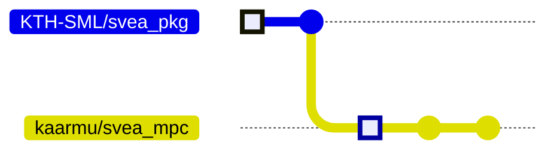
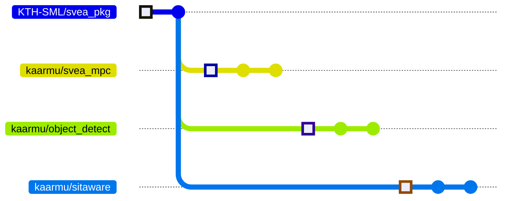
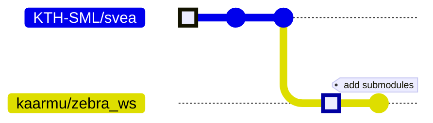

# SVEA and Docker

# Summary

Docker is the solution to standardized, reproducible developer environments.
With its integration, developers need no more worry about the software stack
used in projects no one has touched since forever ago.

# Background

Containers are a way to "package software into standardized units". This is
helpful both for fast and easy development, as well as reliability when it is
time to deploy the product. For SVEA, working with Docker offers a workflow
that ensures that your ROS workspace, and any dependencies, are always
installed correctly. There are many reasons to work with Docker, however,
this background will mainly focus on the ROS installation.

ROS is a large and complex software stack. It is released in "distributions"
(Kinetic, Melodic, Noetic, …) that are tightly coupled with a targeted OS.
For instance, ROS Melodic is released on Ubuntu 18.04 and cannot be installed
on any other Ubuntu version. At writing moment, SVEA requires ROS Melodic. As
a consequence, the SVEA developer must run Ubuntu 18.04.

Beside Ubuntu 18.04 getting old there is another problem with ROS Melodic
specifically. When Melodic was first released, ROS was in the middle of
transitioning to Python 3. Because of this Melodic now runs both Python 2
(which is deprecated since 2020) and Python 3! Well, almost. You need to
install Python 3 in very specific steps which are highly error prone and that
can likely cause your ROS distribution to stop working.

Now consider that SVEA experiments run ROS in each vehicle and each of them
need to have a properly installed system. It is also important to consider
how software environment degenerate over time.

Needless to say it would be nice if a SVEA environment can be set up reliably
each time with no manual configuration at all, using as little as one
command…

## Setup & Workflow

### *I’m using **Linux***

Using Linux makes everything easier. If you are uncomfortable or unfamiliar
with Linux it is recommended that you use the newest version of Ubuntu. In
this case it is also recommended that you learn the basics in how to navigate
and use a terminal.

Before installing Docker, quickly read through the considerations in *"I need
to install Docker".*

- Installing Docker Engine

    For Ubuntu you can install Docker Engine by following
    [these](https://docs.docker.com/engine/install/ubuntu/) steps.

- Installing Docker Desktop

    Since a huge part of the SVEA workflow is to simulate before moving onto
    the vehicles, it is necessary that you have all the necessary tools (such
    as RViz) available to you. Currently Docker Desktop for Linux does not
    allow you to run GUI applications and is therefore not suitable. Please
    install Docker Engine.

---

### *I’m using **Windows***

Windows does not have support Docker Engine natively. Therefore you must use
either of the two options below. Before installing Docker, quickly read
through the considerations in *"I need to install Docker".*

- Installing WSL2 and Docker Engine

    A virtualization layer called Windows Subsystem for Linux (WSL) can be
    enabled/installed natively on Windows 10 Build 19041 and above.  This
    allow for a "real" Linux distribution to run inside of Windows! For
    Windows 11 Build 22000 and above you can even run Linux GUI apps such as
    Nautilus or even RViz for ROS. To install WSL simply run

    ```
    wsl --installs
    ```

    and then reboot. The default distribution that is installed is Ubuntu.
    For more information on WSL follow
    [this](https://docs.microsoft.com/en-us/windows/wsl/install) guide and
    then, if you want read about GUI support, continue with
    [this](https://docs.microsoft.com/en-us/windows/wsl/tutorials/gui-apps).
    After the reboot you can search for, and launch, the "application"
    Ubuntu. It will continue the setup process and you will need to create a
    new user.

    After WSL and Ubuntu is installed and setup you can continue with Docker
    Engine just as described in *"I’m using Linux"*.

- Installing Docker Desktop and an X11 server

    An alternative to WSL is to use Docker Desktop. Although discouraged by
    this guide it is a possibility. If you need to choose this alternative
    then you will have to install an X11 server. The most common one is
    VcXsrv. There is many videos on this topic,
    [here](https://www.youtube.com/watch?v=YbXDJJE5zsc) is one that covers
    most things.

---

### *I’m using **MacOS***

**Note:** This is has not been tested.

Similar to Windows, MacOS does not have support for Docker Engine natively.
Since there is no MacOS equivalent of WSL, Docker Engine cannot be used at
all. Instead you need to use Docker Desktop.

- Installing Docker Desktop

    Although discouraged by this guide Docker Desktop is the only solution
    for MacOS. You will have to install an X11 server for example XQuartz.
    [Here](https://www.youtube.com/watch?v=cNDR6Z24KLM) is a video on the
    topic. Take more inspiration from the instructions given in *"I’m using
    Windows"*.

---

### *I need to install Docker*

Although you can run docker practically anywhere, no matter operating system or hardware, you will probably find it easier to work with on Linux. Even though we recommend Ubuntu for sake of simplicity, in theory, working with docker should be the same regardless of OS.

- Background

    Docker is both a piece of software and a company. The software is
    available through Docker the company’s commercial software
    [Docker Desktop](https://www.docker.com/products/docker-desktop/) or
    their free and open-source
    [Docker Engine](https://docs.docker.com/engine/). Docker Engine is the
    core component for building and running Docker images/containers and is
    thus included in Docker Desktop. However, unless you are running Linux
    you cannot install Docker Engine as a standalone program.

    It is important to know that Docker Desktop run containers inside an
    embedded VM. This can cause some unexpected issues when using the host
    network since you are then actually using the VM’s network. Device access
    and shared volumes can behave similarly. For these reasons it is
    recommended to use Docker Engine if possible. In theory Docker Desktop
    should work fine for simulation. You cannot use it for deployment
    (running on SVEAs) though since there is so much depending on device
    access and the host network. See "*I need to simulate multiple SVEAs"*

- NVIDIA GPUs

    If you have an NVIDIA GPU you can also install
    [NVIDIA Container Toolkit](https://docs.nvidia.com/datacenter/cloud-native/container-toolkit/install-guide.html)
    which is a runtime for Docker Engine that can leverage your GPU, i.e.
    your container get access to your GPU. Notice, however, that if you need
    CUDA drivers then you must use relevant CUDA images.


---

### *I will work on **one** package*

This, with a Linux host, is the most common scenario and best-practice for
most cases.

- Workflow

    The repository `KTH-SML/svea_pkg` is a template for new SVEA packages.
    When starting a new package you should first go to
    `[https://github.com/kth-sml/svea_pkg](https://github.com/kth-sml/svea_pkg)`
    and "Use this template". When doing so GitHub will generate a new
    repository for you much like a fork but separated from `svea_pkg` (you
    cannot create PRs etc.).

    ```mermaid
    %%{init: {'gitGraph': {'mainBranchName': 'KTH-SML/svea_pkg', 'showCommitLabel': false}}}%%
    gitGraph
        commit
        commit
        branch USERNAME/MY_PKG
        commit
        commit
    ```

- Instructions

    - Go to `[https://github.com/KTH-SML/svea_pkg](https://github.com/KTH-SML/svea_pkg)`.
        - Click "Use this template"
        - Change the name to reflect your project, this instruction will use `MY_PKG`.
        - Write a suitable description.

    - Clone your fork to your host computer. From now we assume you stand in the root of `MY_PKG`.

    - Change package name in source code using

    `> util/rename MY_PKG`

    - Add dependencies in `package.xml` and `CMakeLists.txt`.

    - Build image (this will take around 10-15 min on SVEAs) using

    `> util/build`

    - Continue to "*I’m ready to start development".*

---

### *I need to work on **many** packages*

This is for special use cases where you need either more than one package or
higher control over docker (e.g. modifying `Dockerfile`).

- Instructions

    - Create an empty repository on your GitHub account with a ROS workspace name, this instruction will use `MY_PROJ_ws`.
        - Write a suitable description.
        - **Do not** add a `README`, `LICENSE`, or `.gitignore` file this will require you to rebase later on. It is better to modify them later.

    - Clone `[https://github.com/KTH-SML/svea](https://github.com/KTH-SML/svea)` and redirect to your new repository.

    ```bash
    git clone https://github.com/KTH-SML/svea MY_PROJ_ws
    cd MY_PROJ_ws
    git remote set-url origin https://github.com/<username>/MY_PROJ_ws
    ```

    - Change package name in source code using

    `> util/rename MY_PKG`

    - Change `README`, `LICENSE`, or `.gitignore` if necessary.

    - Add dependencies in `package.xml` and `CMakeLists.txt`.

    - Add git submodules for your packages inside the `src` directory as needed.

    `> git submodule add https://github.com/<username>/<my-pkg> src/<my-pkg>`

    - Build image (this will take around 10-15 min on SVEAs) using

    `> util/build`

    - Continue to "*I’m ready to start development".*

---

### *I’m ready to start development*

- Instructions

    - Create a container (in which you will develop) using

    `> util/create`

    - Start the container (will also attach to your terminal) using

    `> util/start`

    - Do development.
        - The image comes with `vim`, `nano` and `git` preinstalled.
        - You can use [this](https://marketplace.visualstudio.com/items?itemName=ms-vscode-remote.vscode-remote-extensionpack) VS Code extension if you prefer that. Read more [here](https://code.visualstudio.com/docs/remote/containers).

    - When you want to exit either enter the command `exit`, use the keyboard shortcut `ctrl+d` or if you want the container to be running in the background, detach using keyboard shortcut `ctrl+p ctrl+q` (you can attach again with `docker attach MY_PKG`).

---

### *I need to use RViz, rqt, or other GUIs*

Due to reasons covered below GUIs cannot be used with SVEA containers. Instead we run a separate container for GUIs. The GUI container then either uses the `host` network or you create a remote connection to `rosmaster` using `util/remote_ros.sh`.

- Background

    ROS images are distributed by the Open Source Robotics Foundation (OSRF) and there are a number of distributions (`melodic`, `noetic`, …) and variants (`base`, `desktop`, …) available. The official ROS images that you get by `docker pull ros:<tag>` are built for different platforms/architectures (`amd64`, `arm64v8`, …), however, some variants are not available there (such as `desktop`). For such variants you need to use OSRF own profile on Docker Hub, `docker pull osrf/ros:<tag>`.  The drawback is that the images under OSRF’s profile are not available for all platforms. This is the case for the TX2 that SVEA has. The `desktop` variant is not built for TX2’s architecture `arm64v8`. That means the SVEA image cannot use another ROS variant other than `base` as we need them to run on the SVEA hardware.

- Using `host` network

- Using `util/remote_ros.sh`

---

### *I need to simulate multiple SVEAs (with their own ROS Master) on one computer*

For this scenario you are probably using something like ABConnect to communicate between your units. This is more than fine and it is possible to simulate as if they were running on completely separate machines.

- Background

    Let’s first consider the normal scenario running "producation" on a SVEA.
    Then the container would share the host’s network and it would seem that
    ROS is running on the host and not inside a container. This is mainly due
    to that the container can open and close ports as it chooses. To share
    the host’s network you use the option `--network host`. It is important
    to remember that you cannot run multiple containers, with a ROS Master
    each, while sharing the host’s network since that would be the same as
    trying to run multiple ROS Masters on your host!

    Next we consider another docker network type, namely `--network bridge`
    (the default network type). This network will allow internet access from
    the host-side to all connected containers, however, all containers’ ports
    are not exposed on the host side. Normally this would **not** be suitable
    for SVEA development and especially so on the real vehicles. However,
    when we are simulating multiple SVEAs on one machine, each with its own
    container, then it can be a useful setup. That is because the containers
    still share the same network, `bridge`, and can actually reach each
    other. Using a broker like ABConnect will establish the shortest route
    for P2P communication and that will be through docker’s internal "router"
    for `bridge` and nothing more, i.e. communication stays within `bridge`
    which is allowed. (If you would try to setup two machines with containers
    on two separate `bridge` networks, then this wouldn’t work since no ports
    are exposed on the hosts.)

    Now, there is a final quirk with docker `bridge` networks. Somehow, the
    default `bridge` network (named `bridge`) does not set up domain name
    resolution for the container name. This means that you need to specify
    container’s IP in order to reach them. If, however, you create a new
    network (of type `bridge`) and connect containers to that, then docker
    will fix domain name resolution for the container names. Then you can
    reach the containers by name, i.e. `ping svea_pkg`. This is what is
    instructed below.

    A useful command for inspecting networks is

    `> docker network inspect my_network`

- Instructions

    - Create, and possibly start, your containers if you haven’t already done so. This can be done with `docker create`, `docker run` or `util/create-dev` (`util/create-dev` will not connect to the host’s network).

    `> util/create-dev`

    `> util/start`

    - Create a new docker network. The network name doesn’t matter, you can use `ros` for example.

    `> docker network create ros`

    - Next you will need to know each container’s name. If you have created the container(s) using `util/create-dev` they will have the same name as the repository they are created from. To confirm the name(s) get a list of all containers using

    `> docker ps -a`

    - Connect each container to the newly created network.

    `> docker network connect ros my_container`

    - Now you can enter the container(s) and develop as you normally would. They will exist (almost) as separate machines connected to the virtual network `ros`. This network does give them internet access but no ports are exposed to the host.

---

### *I’m ready to deploy (running on SVEA)*

Is there actually something different in this step?

---

## Example scenario

I (username `kaarmu`) have decided to create an MPC controller package `svea_mpc` for
SVEA in a fictional project about safe zebra crossings. We assume I’ve
already installed docker and have a working system using one of the methods
described in this tutorial. Since I only want to develop one package I can
base it on `KTH-SML/svea_pkg`.



Read more on *"I’m will work on one package"*.

After implementing my controller, now I want to evaluate it using simulation
in RViz. This is a bit tricky depending on the system I’m using. Supposing
I’m using Linux, I only need two terminals running the following

```bash
## HOST ubuntu22 ##
util/create
util/start
## CONTAINER svea_mpc ##
roscore &
roslaunch svea_mpc test.launch
```

```bash
## HOST ubuntu22 ##
util/gui --network host
## CONTAINER autogen_name ##
# there is a config at
# svea_mpc/util/test.rviz
rosrun rviz rviz -d /svea_mpc/util/test.rviz
```

where on the left terminal I have `roscore` and my implementation running,
and on the right I have a special GUI container running `rviz`. Notice that
in this scenario we have `svea_mpc` using the `host` network. This means that
the GUI container should also run on the `host` network. Read more about GUIs
in "*I need to use RViz, rqt, or other GUIs".*

Some time has passed and I have realized that my SVEA needs object detection
and situational awareness. I keep them separate by creating the packages
`object_detect` and `sitaware`. My project now includes 3 packages in total
(except for `svea_core`, `svea_sensors`, etc. that’s included). This forces
me to create my own workspace instead of using `svea` workspace (that is
automatically used for single-package projects).

First, I will need to create `object_detect` and `sitaware` from `svea_pkg`.
The graph from above would now look something like this



To create my new workspace I will base it on `svea` just as I did with
`svea_mpc` from `svea_pkg`. The workspace will be called `zebra_ws` to
reflect my project.



The `zebra_ws` workspace can now add these repositories as submodules.

```
zebra_ws/
    Dockerfile
    entrypoint
    src/
        object_detect/      << new submodule
        sitaware/           << new submodule
        svea_core/
        svea_mpc/           << new submodule
        svea_sensors/
        vehicle_msgs/
    util/
```

From here on you work just as before but simply from the workspace repository instead of a package! The utility scripts will still work as expected and you follow almost the same practices with Git. The difference now is that you must be aware of the submodules. Please read online on how to effectively work with submodules.

## Utility scripts reference

### `util/build`

Build an image with the following options:

- `--network host`: Use host network when building.
- `--build-arg ROSDISTRO`: Use `ROSDISTRO` from `config.sh`
- `--build-arg WORKSPACE`: Use `WORKSPACE` from `config.sh`

### `util/create`

Create a container with the following options:

- `-it`: Make it interactive (attach `STDIN`). Allocate TTY in container.
- `-e TERM=xterm-256color`: Make terminal colorful.
- `-v <host-src>:<container-dest>`: [Shared volume](https://docs.docker.com/storage/volumes/) for workspace/package.
- `-v /dev:/dev`: New device connections will be visible inside the container.
- `--network host`: Use the host’s network.
- `--privileged`: Allow access to host’s devices.
- `--name <name>`: Give the container a name.

### `util/create-dev`

Create a container with the same options as `util/create` except:

- `--network host` is removed. Container will use the default network `bridge`.
- `--privileged` is removed. Container will not have access to devices.
- `-v /dev:/dev`: is removed. Container will not have access to devices.

### `util/config.sh`

Can be sourced for common variables such as workspace location etc.

The following environment variables are set once `util/config.sh` is sourced:

- `REPOSITORY_PATH`: Absolute path to the repository you are in.
- `REPOSITORY_NAME`: Base name of the repository (should be same as project name).
- `BUILD_CONTEXT`: Read the description on `[docker build](https://docs.docker.com/engine/reference/commandline/build/#description)`. If you are using `util/config.sh` from the template `svea_pkg`, then it will try to locate a workspace next to its own repository to increase build speeds by allowing docker to cache. The rule is: if the package is located at `<path>/MY_PROJECT` then expect a workspace to exist at `<path>/MY_PROJECT_ws`.
- `IMAGE_TAG`: Name of the built image.
- `CONTAINER_NAME`: Name of the created container.
- `ROSDISTRO`: The used ROS distribution. Do **not** change this.
- `WORKSPACE`: The absolute path to the ROS workspace inside the container.
- `SHRVOL_SRC`: Absolute path to directory (host side) that should be shared with container.
- `SHRVOL_DST`: Absolute path to directory (container side) that should be shared with container.

### `util/gui`

Run a container suitable for GUI applications such as RViz or rqt.

### `util/remote_ros.sh`

*Note: This script should be sourced*.

Set up ROS environment variables for a remote ROS Master. Takes one argument, the master’s hostname. If no argument is given, it is assumed ROS Master runs on the same machine.

### `util/start`

Start container with the following options:

- `-i`: Make the container interactive (attach `STDIN`).

### `util/rename`

Rename package to match the repository.
