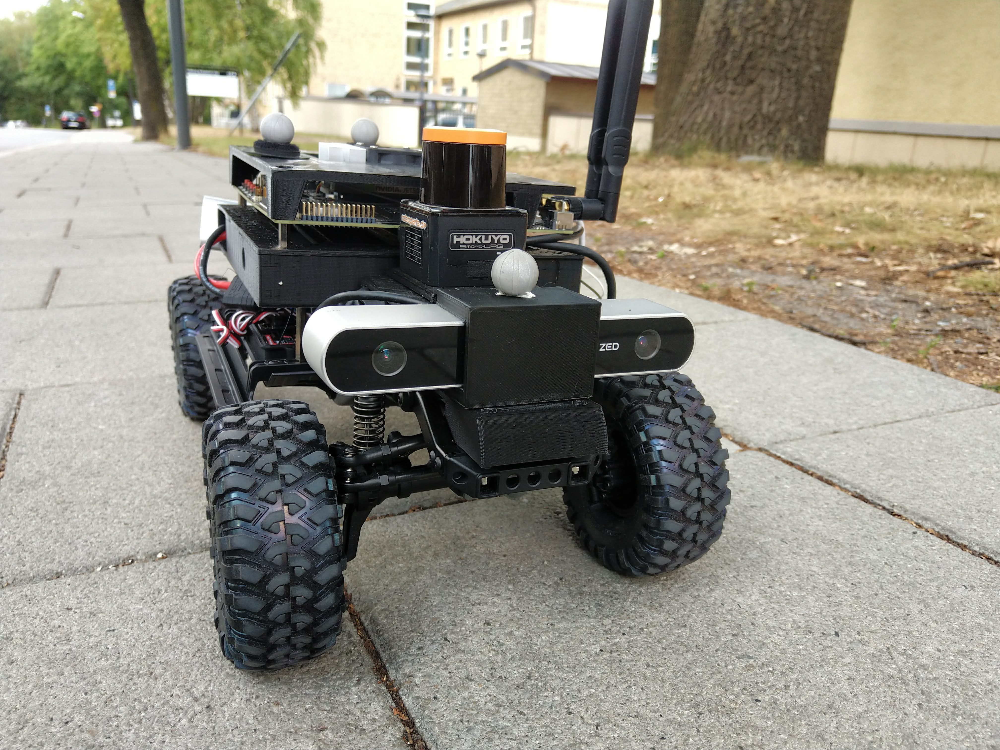

# Welcome!

Welcome to the documentation of the Small Vehicles for Autonomy (SVEA) platform!
Currently, the documentation is focused towards giving an overview of the
different modules and functionalities provided by the this workspace.
For instructions on how to install and use the different tools in the
this workspace, please refer to the README on the Github repo.

<<<<<<< HEAD
<<<<<<< HEAD
Spot any typos? Please let [kajarf@kth.se] know.
=======
Spot any typos? Please let [frankji@kth.se] know.
>>>>>>> 3afea11 (add docs)
=======
Spot any typos? Please let [kajarf@kth.se] know.
>>>>>>> c793f13 (update email for document)

