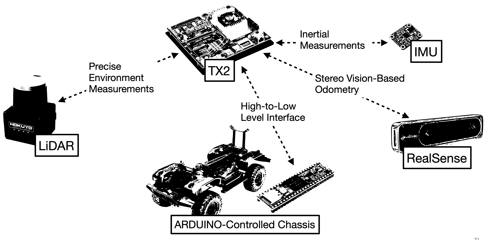

# Introduction

In this tutorial, we will introduce the SVEA hardware and software, and discuss
some of the organization around the SVEA software stack.

## Hardware



The SVEA platform consists of the following hardware components:

1. [Single-channel LiDAR](https://www.hokuyo-usa.com/products/lidar-obstacle-detection/ust-10lx)
2. [IMU](https://www.adafruit.com/product/2472)
3. [Stereo tracking camera](https://www.intelrealsense.com/tracking-camera-t265/) (outputs only odometry)
4. [RC-vehicle chassis](https://traxxas.com/products/landing/trx-4/)
5. RC Remote
6. [Teensy arduino](https://www.pjrc.com/store/teensy40.html)
7. Signal and Power Management Board (SPMB)
8. [NVIDIA TX2](https://developer.nvidia.com/buy-jetson?product=jetson_tx2&location=US)

As described in the diagram above, the TX2 is the main computer where all sensor
data goes and where all high-level decision+control is made. The TX2 runs NVIDIA's
JetPack SDK which includes their implementation of Ubuntu 18.04 for ARM.

The original RC remote still works to control the chassis, with some additional
features added on. In particular, in addition to the RC remote's standard
features, we have also added a override to the RC remote. By putting the metal
switch on top of the remote into the most forward position, the Teensy will
start ignoring any actuation commands from ROS nodes on the TX2 and **only listen
to the RC remote**. Thus it's a good idea to always keep the remote around in case
you need to stop the vehicle from doing something unsafe.

To interface with the vehicle chassis, the TX2 communicates with the Teensy
arduino, which is connected to and manages the SPMB board. The Teensy's firmware
provides a ROS interface, dubbed the low-level interface (lli), which can be
used by other ROS nodes running on the TX2 to actuate the vehicle chassis (the
motor, servo, transmission, etc.) and to get reports on what is *actually*
being actuated on the chassis (it could be the case that the requested actuation
by a ROS node may not be implemented by the Teensy). A good way to see what the lli
interface can handle is to look at the `lli_ctrl.msg`, which is the message that
is used for both sending commands to and receiving reports from the Teensy:

```
int8 steering
int8 velocity
int8 trans_diff
int8 ctrl
```

Here, `steering` and `velocity` do not have the typical units. Instead of [rad]
and [m/s] both have integer values from 127 to -127.
For `steering`, this corresponds to a steering range between about 45 degrees
($\pi/4$ radians) to the left and -45 degrees ($-\pi/4$ radians) to the right,
respectively. The resultant heading change of the vehicle will also be affected
by whether the front and/or rear differential locks are locked or not. For
`velocity`, this corresponds to a range between max speed forward and max speed
backward/braking, respectively. The Electronic Speed Controller (ESC) will
decide whether to implemet negative velocity or brake based on the previous
velocities. The absolute resulting velocity mostly depends on what gear the
vehicle is in and how discharged the battery is. However, you can expect the
vehicle to move at speeds between 1.7 m/s and -1.7 m/s on low gear+full battery
and at speeds between 3.6 m/s and -3.6 m/s on high gear+full battery.
`trans_diff` can be used to affect what gear the vehicle is in and which
differetial locks are on. Finally, `ctrl` is a field that is only important
when receiving reports from the Teensy where it is used to communicate whether:
1. the TX2 has been detected by the Teensy to be idle
2. the RC remote is disconnected
3. the RC remote is in override mode

Since it's a bit complicated to write controllers that compute steering and
velocity in a range from [-127, 127] and set the right bit in `trans_diff` we
have added methods to the `ActuationInterface` class in
`svea_core/src/svea/interfaces/actuation.py` so you can conveniently affect these
mechanics. In most cases, the `ActuationInterface` should satisfy your actuation
requirements.

## Software

In general, many of the basic funcions needed on the SVEA platform have
convenient python interfaces. You can see them in
`svea_core/src/svea/`.

For the SVEA platform's library, we have focused on wrapping ROS-related tasks
with clean python interface objects. To handle ROS' asynchronous nature, we
always thread the callback functions inside of these interface objects. This
means that once an interface object has been initialized and started (using a
method that's always called `start()`), a callback that is running on a separate
thread will take data that is communicated via ROS and update an object variable
that is accessible to the scope where the object was instanstiated. Since each
of these object's callbacks run on a separate thread, we can run the interface
objects in the same thread and access all of their data from one script. This
has many benefits, but the most important ones are:

1. We can program/script in the more common Python OOP style, instead of
   conforming to the traditional rospy style of designing a web of ROS nodes
2. We can do a task with a single script
3. We only need to debug from a single script
4. We can actually use debuggers like `pdb` in this single script
5. We can write this script to look more like how we view problems on a
   high-level.

In addition, we have written these python interface objects to be agnostic to
whether you are running your script in simulation or on the real vehicle. To do
this, we have designed the simulation environment to match the information
signals of the actual vehicle. This means that after testing your script in
simulation, to test it on the real car, you simply need to stop running the
simulation node and include some hardware-related launch files in your project
launch. For more details, see the **Going from simulation to real** section in
the repo's README. Note, even though we have put in the effort to match the
simulation information signals to the real cars, the real car will still run
differently than the simulation. This is could be due to the real car's physics
being different/more rich than our model and low level software phenomenon in
the Arduino and speed controller firmware that we have deemed both too complex
and too inconsequential to include in the simulation.

Instead of taking my word for it, take a look for yourself! In the next
tutorial, we will guide you through an example where you will adjust a script in
simulation and then run it on a real vehicle.

