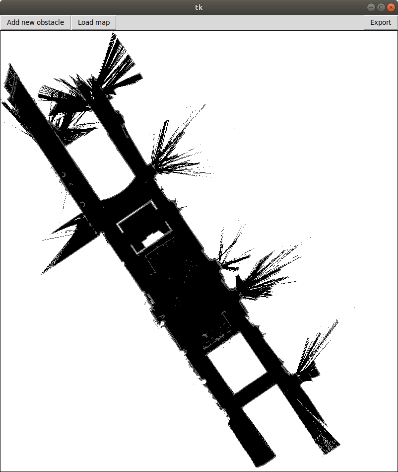
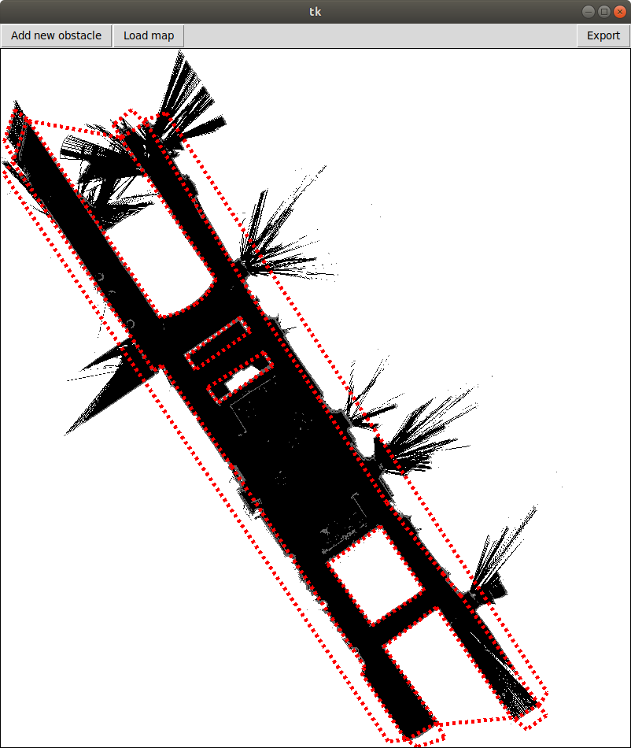
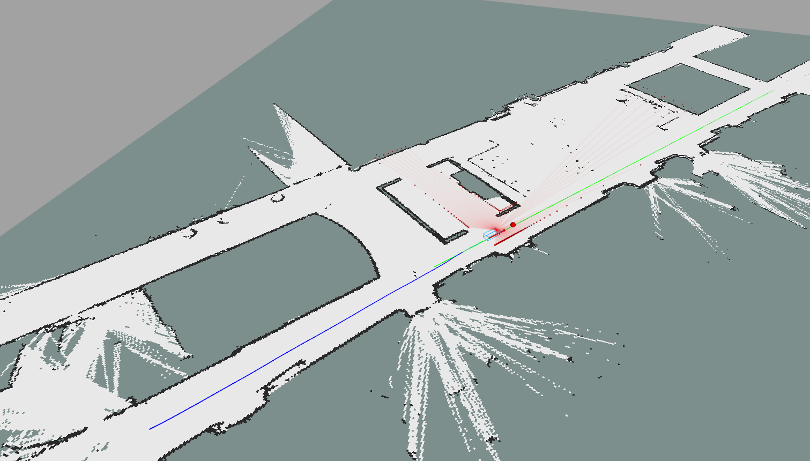

# Lidar Simulation

In this tutorial, we will introduce the lidar simulation pipeline that is
available in this repo. The lidar simulation we have implemented relies on predefining
all the obstacles you want the lidar to emulate as polygons. To do this, you
need to edit the configuration file: `svea_core/params/obstacles.yaml`.
In there you will see a list of polygon vertices listed in either clockwise or
conter-clockwise order.

## Obstacle Editor GUI

To make the additions of obstacles easier, we have provided a GUI for creating
obstacles on a given map. You might need to install some extra dependencies
before we can try running the GUI. Start by adding libraries you are likely
missing:

```
sudo apt install python3-tk
pip3 install numpy pillow
```

Then, try running the obstacle building GUI using the following commands
(**Note, if errors occur while running it, you likely need to install more
dependencies**):

```
roscd svea_core/util
python3 obstacles_builder_gui.py
```

Once you have successfully run the GUI, you should see a blank window. On this
window, there are three buttons you can press: "Add new obstacle", "Load map",
and "Export". "Add new obstacle" is the button we will use to create new and
finish drawing obstacles. However, before you create a new obstacle, let's first
load in a map. The GUI will only load in pickle files, since we need the
OccupancyGrid to know what pixels in the image correspond to what coordinates in
the OccupancyGrid. A pickle has already been created for floor2, so you can load
it in from `svea_core/maps/floor2.pickle`. After loading the floor2
map in, your window should look something like:



Now, to add a new obstacle press "Add new obstacle" and after that, every point
you click on the map will be a vertex in a new, polygonal obstacle. You should
try to close the polygon, since this is usually most convenient. As soon as you
are done creating vertices, click the "Finish obstacle" button. Repeat this
until you have created all the obstacles you want to. Once you are done creating
obstacles, you can simply click the "Export" button and save the yaml file in a
good place (we recommend `svea_core/params`). There is already a file
in `svea_core/params` called `obstacles.yaml`. In `obstacles.yaml`, we
have added an example set of obstacles that correspond to the walls of floor2.
If you want to keep this, it's best you save your obstacles as a new file. The
obstacle set we have created looks like this:



It's likely that you will make a mistake at some point while using the GUI.
Unfortunately, there is no "undo" button in the GUI currently. Thus, to fix this
mistake you can either keep on adding obstacles and fix the mistake in the yaml
file after "Exporting", or you can start over and lose all of your drawn
obstacles by loading in the map again.

If you have created several more yaml files, you can load them in instead of the
default floor2 obstacles by editing the following line in your launch file:

```xml
<rosparam command="load" file="$(find svea_core)/params/obstacles.yaml" />
```

where you can change `obstacles.yaml` to whatever obstacles file you want
instead. You can check that the obstacles loaded correctly by using the
`rosparam` command. For more details, run `rosparam -h` to see what commands are
available.

## Activating the Lidar Simulator

Since the Lidar simulator is often computationally demanding, it is
not activated by default. To use it, you will need to activate it from your
project script. To understand how to enable it, look carefully at the
initialization of the `SimSVEA` class defined in
`svea_core/src/svea/simulators/sim_SVEA.py`. *Hint: you should not edit SimSVEA,
but enable the lidar simulator from outside the class*.

Once you have enabled the Lidar simulator, try running the floor2 example once
more and you should see some new visualizations showing up. For example, it
should look something like this:



Now that you can see the simulated lidar in RVIZ, let's try to do something with
the laser scans themselves. The lidar simulator will actually publish out scan
data to the ROS network as if it was a real lidar driver: give it a check using
the `rostopic` command.

If the data is successfully publishing to the ROS network, then the SVEA manager
will already be receiving it. Knowing this, try and figure out how to use the
scan data from your project script and print out
the closest point in the scan to the vehicle.
