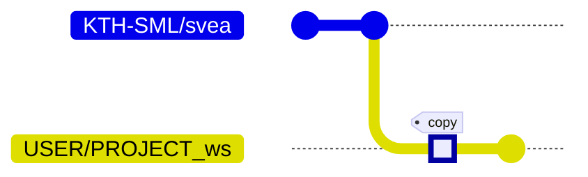

# Docker

### Summary

Docker is the solution to standardized, reproducible developer environments.
With its integration, developers do not need to worry about running projects no
one has touched since forever ago. Now SVEA will also run using docker! This
new workflow seeks to create an effortless and powerful developer experience by
combining ROS and docker.

## Background

Containers are a way to "package software into standardized units". This is
helpful both for fast and easy development as well as for reliability when it
is time to deploy the product. For SVEA, working with Docker offers a workflow
that ensures that your ROS workspace, and any dependencies, are always
installed correctly. There are many reasons to work with Docker, however,
this background will mainly focus on the ROS installation.

ROS is a large and complex software stack. It is released in "distributions"
(Kinetic, Melodic, Noetic, …) that are tightly coupled with a targeted OS.
For instance, ROS Noetic is released on Ubuntu 20.04 and cannot be installed
on any other Ubuntu version. At writing moment, SVEA requires ROS Noetic. As
a consequence, the SVEA developer must run Ubuntu 20.04. Besides OS constraints
the installation of ROS and any project dependencies can be highly error prone.
It is also important to consider how a software environment degenerate over
time. All of these problems are easily avoided with containerization. Needless
to say it would be nice if a SVEA environment can be set up reliably each time
with no manual configuration at all, using as little as one command…

## Setup & Workflow

### *Installing Docker*

See the [next page](tutorials/5_more_docker.md).

### *I'm starting a new project*

**Workflow**

The `svea` repository can be used as a template for new SVEA projects. When
starting a new project you should go to
[`svea`](https://github.com/kth-sml/svea) and click "Use this template". When
doing so GitHub will copy `svea`, all of its content and history, to a new
separate repository. This is very similar to forking but the difference being
that `svea` and your new project will not be linked, i.e. `svea` is copied but
will not be an "upstream" source you can push to.



**Instructions**

- Go to [`svea`](https://github.com/kth-sml/svea).

    - Click "Use this template"

    - Change the name to reflect your project. This instruction will use
      `PROJECT_ws` where `_ws` emphasize that this is a ROS workspace.

    - Write a suitable description.

- Clone `PROJECT_ws` to your host computer.

    ```
    > git clone https://github.com/USER/PROJECT_ws
    > cd PROJET_ws
    ```

- Change `README`, `LICENSE`, or `.gitignore` if necessary.

- Add any additional ROS packages in `src` for your project.

- Add any additional python dependencies in `requirements.txt`.

- Build image (this will take a few minutes depending on your machine) using

    ```
    > util/build
    ```

- Continue to [I’m ready to start development](#im-ready-to-start-development).

---

### *I’m ready to start development*

This workflow allow us to deploy *and* develop inside the container. In fact,
it might be easier for you to develop inside the container as you can work from
any distribution, not only Ubuntu.

**Instructions**

- Run a container using

    ```
    > util/run
    ```

- Do development.

    - The image comes with a few tools preinstalled (`git`, `vim`, `nano`,
      `curl`, `ping`).

    - You can use [this](https://marketplace.visualstudio.com/items?itemName=ms-vscode-remote.vscode-remote-extensionpack)
      VS Code extension if you prefer that. Read more [here](https://code.visualstudio.com/docs/remote/containers).

- When you want to exit either enter the command `exit`, use the keyboard
  shortcut `ctrl+d` or if you want the container to be running in the
  background, detach using keyboard shortcut `ctrl+p ctrl+q` (you can
  attach again with `docker attach PROJECT_ws`).

- If you want to enter a container that has been previously exited then call

    ```
    > docker start -i <name>
    ```

    **Note:** If GUI applications does not work when doing this it might be
    because you haven't allowed Docker in X11. This is something that is done
    for you in `util/run`.

---

### *I’m ready to deploy (running on SVEA)*

**Instructions**

- Start the SVEA.

- Use SSH to remote connect to the SVEA. SVEAs' hostname are typically `svea#`
  where `#` is a number, e.g. SVEA3 will have the hostname `svea3`.

    ```
    > ssh nvidia@svea#
    ```

- Clone `PROJECT_ws` to the SVEA.

    ```
    > git clone https://github.com/USER/PROJECT_ws
    > cd PROJECT_ws
    ```

- Deploying is very similar to developing with Docker, simply build and run
  without `DESKTOP=1`. Building will take around 10-15 min on SVEAs.

    ```
    > util/build
    > util/run
    ```

- Your workspace will be sourced automatically so at this step you should be
  able to launch your project.

    ```
    > roslaunch ...
    ```

---

## Docker Cheat Sheet

: `docker build -t svea .`

    Build an image and name it `svea`.

    *Use SVEA's utility script `build` instead.*

: `docker create -it --name zebra svea`

    Create a container from the image `svea` and name it `zebra`.

    *Unless necessary, use utility script `run` instead.*

: `docker start -i zebra`

    Start the container `zebra` (it must be created).

    *Unless necessary, use utility script `run` instead.*

: `docker run -it svea`

    Do `docker create` followed by a `docker start`.

    *Use SVEA's utility script `run` instead.*

: `docker exec -it svea [command...]`

    Execute command as a sibling process to a running container. (Useful to start separate terminal with command `bash`).

: `docker images`

    List all images.

: `docker ps -a`

    List all containers.

: `docker container prune`

    Remove all exited containers.

: `docker image prune -a`

    Remove all images not associated with a container.

## Utility scripts reference

: `util/build`

    Build an image with the following options:

    - `--network host`: Use host network when building.
    - `--build-arg ROSDISTRO`: Use `ROSDISTRO` from `config.sh`
    - `--build-arg WORKSPACE`: Use `WORKSPACE` from `config.sh`

: `util/run`

    Run a container with the following options:

    - `-it`: Make it interactive (attach `STDIN`). Allocate TTY in container.
    - `-e TERM=xterm-256color`: Make terminal colorful.
    - `-v <host-src>:<container-dest>`: [Shared volume](https://docs.docker.com/storage/volumes/) for workspace/package.
    - `-v /dev:/dev`: New device connections will be visible inside the container.
    - `--network host`: Use the host’s network.
    - `--privileged`: Allow access to host’s devices.
    - `--name <name>`: Give the container a name.

: `util/run-dev`

    Run a container with the same options as `util/create` except:

    - `--network host` is removed. Container will use the default network `bridge`.
    - `--privileged` is removed. Container will not have access to devices.
    - `-v /dev:/dev`: is removed. Container will not have access to devices.

: `util/config.sh`

    Can be sourced for common variables such as workspace location etc.

    The following environment variables are set once `util/config.sh` is sourced:

    - `REPOSITORY_PATH`: Absolute path to the repository you are in.
    - `REPOSITORY_NAME`: Base name of the repository (should be same as project name).
    - `BUILD_CONTEXT`: Read the description on `[docker build](https://docs.docker.com/engine/reference/commandline/build/#description)`. If you are using `util/config.sh` from the template `svea_pkg`, then it will try to locate a workspace next to its own repository to increase build speeds by allowing docker to cache. The rule is: if the package is located at `<path>/MY_PROJECT` then expect a workspace to exist at `<path>/MY_PROJECT_ws`.
    - `IMAGE_TAG`: Name of the built image.
    - `CONTAINER_NAME`: Name of the created container.
    - `ROSDISTRO`: The used ROS distribution. Do **not** change this.
    - `WORKSPACE`: The absolute path to the ROS workspace inside the container.
    - `SHRVOL_SRC`: Absolute path to directory (host side) that should be shared with container.
    - `SHRVOL_DST`: Absolute path to directory (container side) that should be shared with container.

: `util/remote_ros.sh`

    Set up ROS environment variables for a remote ROS Master. Takes one argument, the master’s hostname. If no argument is given, it is assumed ROS Master runs on the same machine.

    *Note: This script should be sourced*.

