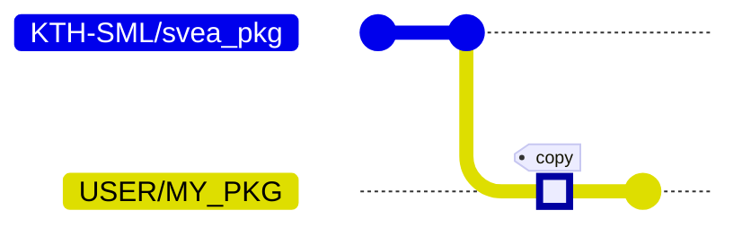
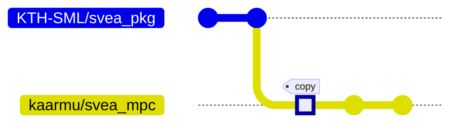
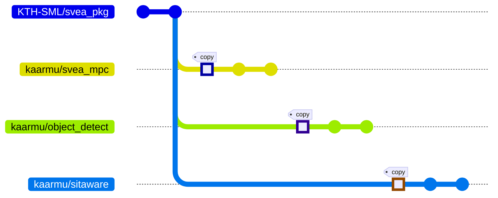
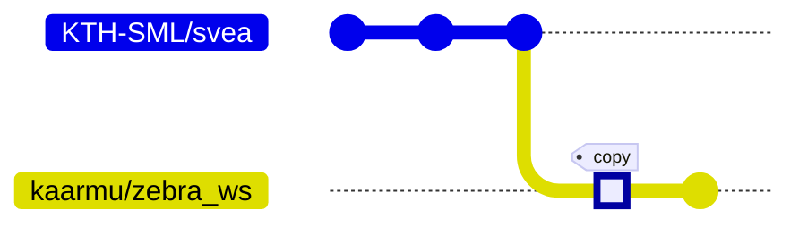

# Advanced Docker Workflows

## Setup & Workflow

### *I need to install Docker*

Although you can run docker practically anywhere, no matter operating system or
hardware, you will probably find it easier to work with on Linux. Even though
we recommend Ubuntu for the sake of simplicity, in theory, working with docker
should be the same regardless of OS.

**Background**

Docker is both a piece of software and a company. The software is
available through Docker the company’s commercial software
[Docker Desktop](https://www.docker.com/products/docker-desktop/) or
their free and open-source
[Docker Engine](https://docs.docker.com/engine/). Docker Engine is the
core component for building and running Docker images/containers and is
thus included in Docker Desktop. However, unless you are running Linux
you cannot install Docker Engine as a standalone program.

It is also important to know that Docker Desktop run containers inside an
embedded VM. This can cause some unexpected issues when using the host
network since you are then actually using the VM’s network. Device access
and shared volumes can behave similarly. For these reasons it is
recommended to use Docker Engine if possible. In theory Docker Desktop
should work fine for simulation. You cannot use it for deployment
(running on SVEAs) though since there is so much depending on device
access and the host network. See "*I need to simulate multiple SVEAs"*

**NVIDIA GPUs**

If you have an NVIDIA GPU you can also install
[NVIDIA Container Toolkit](https://docs.nvidia.com/datacenter/cloud-native/container-toolkit/install-guide.html)
which is a runtime for Docker Engine that can leverage your GPU, i.e.
your container get access to your GPU. Notice, however, that if you need
CUDA drivers then you must use relevant CUDA images.

---

### *I’m using Linux*

Using Linux makes everything easier. If you are uncomfortable or unfamiliar
with Linux it is recommended that you use the newest version of Ubuntu. In
this case it is also recommended that you learn the basics of how to use a
terminal.

**Installing Docker Engine**

For Ubuntu you can install Docker Engine by following
[these](https://docs.docker.com/engine/install/ubuntu/) steps.

A quick and easy way (but not recommended) is to run
```
sudo util/get-docker
```
This will download and run a script that installs Docker Engine for you. Read
more [here](https://docs.docker.com/engine/install/ubuntu/#install-using-the-convenience-script).

**Installing Docker Desktop**

Since a huge part of the SVEA workflow is to simulate before moving onto
the vehicles, it is necessary that you have all the necessary tools (such
as RViz) available to you. Currently Docker Desktop for Linux does not
allow you to run GUI applications and is therefore not suitable. Please
install Docker Engine.

**Post-Installation steps**

For a pleasant `docker` experience in the terminal you should do the following
post-installation steps. Reboot your computer after these steps.

1. Add your user to the `docker` group.

```
sudo groupadd docker
sudo usermod -aG docker $USER
```

2. Start/Enable the docker service

```
# On most distros (like vanilla Ubuntu)
sudo systemctl enable docker.service
sudo systemctl start docker.service
# ...on other (like WSL-based Ubuntu)
# This must be done each time you start the computer/session
sudo service docker start
```

---

### *I’m using Windows*

Windows does not have support for Docker Engine natively. Therefore you must
use one of the two options below.

**Installing WSL2 and Docker Engine**

A virtualization layer called Windows Subsystem for Linux (WSL) can be
enabled/installed natively on Windows 10 Build 19041 and above.  This
allow for a "real" Linux distribution to run inside of Windows! For
Windows 11 Build 22000 and above you can even run Linux GUI apps such as
Nautilus or even RViz for ROS. To install WSL simply run

```
wsl --install
```

and then reboot. The installed default distribution is Ubuntu. For more
information on installing WSL follow
[this](https://docs.microsoft.com/en-us/windows/wsl/install) guide and
then, if you want to read about GUI support, continue with
[this](https://docs.microsoft.com/en-us/windows/wsl/tutorials/gui-apps).
After the reboot you can search for, and launch, the "application"
Ubuntu. It will continue the setup process and you will need to create a
new user.

After WSL and Ubuntu is installed and setup you can continue to install
Docker Engine just as described in [I’m using Linux](#im-using-linux).

**Installing Docker Desktop and an X11 server**

An alternative to WSL is to use Docker Desktop. Although discouraged by
this guide it is a possibility. If you need to choose this alternative
then you will have to install an X11 server. The most common one is
**VcXsrv**. There is many videos on this topic,
[here](https://www.youtube.com/watch?v=YbXDJJE5zsc) is one that covers
most things.

---

### *I’m using MacOS*

**Note:** This is has not been tested.

Similar to Windows, MacOS does not have support for Docker Engine natively.
Since there is no MacOS equivalent of WSL, Docker Engine cannot be used at
all. Instead you need to use Docker Desktop.

**Installing Docker Desktop**

Although discouraged by this guide Docker Desktop is the only solution
for MacOS. You will have to install an X11 server for example XQuartz.
[Here](https://www.youtube.com/watch?v=cNDR6Z24KLM) is a video on the
topic. Take more inspiration from the instructions given in
[I’m using Windows](#im-using-windows).

---

### *I will work on a single package*

**Workflow**

Similar to [`svea`](https://github.com/kth-sml/svea) repository,
[`svea_pkg`](https://github.com/kth-sml/svea_pkg) is a template for new SVEA
packages. When starting a new package you should first go to
[svea_pkg](https://github.com/kth-sml/svea_pkg) and click "Use this template".
When doing so GitHub will copy `svea_pkg` to a new repository much like a fork
but that is completely separated from `svea_pkg` (you cannot create PRs etc.).



**Instructions**

- Go to [`svea_pkg`](https://github.com/KTH-SML/svea_pkg).

    - Click "Use this template"

    - Change the name to reflect your project, this instruction will use
      `MY_PKG`.

    - Write a suitable description.

- Clone your fork to your host computer.

    ```
    > git clone https://github.com/USER/MY_PKG
    > cd MY_PKG
    ```

- Change package name in source code, `CMakeLists.txt`, `package.xml`, etc.

- Add dependencies in `package.xml` and `CMakeLists.txt`.

- Build image (this will take a few minutes depending on your machine). This
  step will make Docker fetch `svea` and place `MY_PKG` inside `svea/src`,
  finally producing an image containing all of `svea` and `MY_PKG`.

    ```
    > DESKTOP=1 util/build
    ```

    **Note:** You cannot use `DESKTOP=1` on SVEA, it will only work on `amd64`
    (normal) computers.

- Continue to [I’m ready to start development](4_docker.md#im-ready-to-start-development).

---

### *I need to use RViz, rqt, or other GUIs*

**Background**

ROS images are distributed by the Open Source Robotics Foundation (OSRF)
and there are a number of distributions (`melodic`, `noetic`, …) and
variants (`base`, `desktop`, ...) available. The official ROS images that you
get by `docker pull ros:<tag>` are built for different platforms/architectures
(`amd64`, `arm64v8`, …), however, some variants are not available there
(such as `desktop`). For such variants you need to use OSRF's own profile on
Docker Hub, `docker pull osrf/ros:<tag>`.  The drawback is that the images
under OSRF’s profile are not available for all platforms. This is the case
for the TX2 that SVEA has. The `desktop` variant is not built for TX2’s
architecture `arm64v8`. That means the SVEA image cannot use another
ROS variant other than `base` as we need them to run on the SVEA
hardware.

So, normally GUI applications cannot be launched in a container without any
configuration. Luckily our utility scripts fixes this automatically. When
the SVEA image has been built with `DESKTOP=1 util/build` and the container
has been created with `DESKTOP=1 util/run` then GUIs are supported (only
for supported architectures such as `amd64`, not on the NVIDIA TX2).

**Instructions**

- Make sure to build and run using `DESKTOP=1` as described in
  [I'm starting a new project](4_docker.md#im-starting-a-new-project) and
  [I will work on a single package](#i-will-work-on-a-single-package).

---

### *I need to simulate multiple SVEAs (with their own ROS Master) on one computer*

For this scenario you are probably using something like ABConnect to
communicate between your units. This is more than fine and it is possible to
simulate as if they were running on completely separate machines.

**Background**

Let’s first consider the normal scenario running "producation" on a SVEA.
Then the container would share the host’s network and it would seem that
ROS is running on the host and not inside a container. This is mainly due
to that the container can open and close ports as it chooses. To share
the host’s network you use the option `--network host`. It is important
to remember that you cannot run multiple containers, with a ROS Master
each, while sharing the host’s network since that would be the same as
trying to run multiple ROS Masters on your host!

Next we consider another docker network type, namely `--network bridge`
(the default network type). This network will allow internet access from
the host-side to all connected containers, however, all containers’ ports
are not exposed on the host side. Normally this would **not** be suitable
for SVEA development and especially so on the real vehicles. However,
when we are simulating multiple SVEAs on one machine, each with its own
container, then it can be a useful setup. That is because the containers
still share the same network, `bridge`, and can actually reach each
other. Using a broker like ABConnect will establish the shortest route
for P2P communication and that will be through docker’s internal "router"
for `bridge` and nothing more, i.e. communication stays within `bridge`
which is allowed. (If you would try to setup two machines with containers
on two separate `bridge` networks, then this wouldn’t work since no ports
are exposed on the hosts.)

Now, there is a final quirk with docker `bridge` networks. Somehow, the
default `bridge` network (named `bridge`) does not set up domain name
resolution for the container name. This means that you need to specify
container’s IP in order to reach them. If, however, you create a new
network (of type `bridge`) and connect containers to that, then docker
will fix domain name resolution for the container names. Then you can
reach the containers by name, i.e. `ping svea_pkg`. This is what is
instructed below.

A useful command for inspecting networks is

```
> docker network inspect my_network
```

**Instructions**

- Create, and possibly start, your containers if you haven’t already done
  so. This can be done with `docker create`, `docker run` or `util/run-dev`
  (`util/run-dev` will not connect to the host’s network).

    ```
    > util/run-dev
    ```

- Create a new docker network. The network name doesn’t matter, you can use
  `ros` for example.

    ```
    > docker network create ros
    ```

- Next you will need to know each container’s name. If you have created the
  container(s) using `util/create-dev` they will have the same name as the
  repository they are created from. To confirm the name(s) get a list of
  all containers using

    ```
    > docker ps -a
    ```

- Connect each container to the newly created network.

    ```
    > docker network connect ros my_container
    ```

- Now you can enter the container(s) and develop as you normally would.
  They will exist (almost) as separate machines connected to the virtual
  network `ros`. This network does give them internet access but no ports
  are exposed to the host.

---

## Example scenario

I (username `kaarmu`) have decided to create an MPC controller package `svea_mpc` for
SVEA in a fictional project about safe zebra crossings. We assume I’ve
already installed docker and have a working system using one of the methods
described. Since I only want to develop one package I can base it on `KTH-SML/svea_pkg`.



Read more on [I will work on a single package](#i-will-work-on-a-single-package).

After implementing my controller, now I want to evaluate it using simulation
in RViz. It is recommended to start `roscore` separately.

```bash
## HOST ubuntu22 ##
util/run
## CONTAINER svea_mpc ##
roscore &
rosrun rviz rviz -d <path-to-rviz-file>
roslaunch svea_mpc test.launch
```

---

Some time has passed and I have realized that my SVEA needs object detection
and situational awareness. I keep them separate by creating the packages
`object_detect` and `sitaware`. My project now includes 3 packages in total
(except for `svea_core`, `svea_sensors`, etc. that’s included). This forces
me to create my own workspace instead of using `svea` workspace (that is
automatically used for single-package projects).

First, I will need to create `object_detect` and `sitaware` from `svea_pkg`
in the same way `svea_mpc` was created. The graph from above would now look
something like this



To create my new workspace I will base it on `svea` just as I did with
`svea_mpc` from `svea_pkg`. The workspace will be called `zebra_ws` to
reflect my project.



The `zebra_ws` workspace can now add these repositories as submodules.

```
> git submodule add https://github.com/kaarmu/object_detect src/object_detect
> git submodule add https://github.com/kaarmu/sitaware src/sitaware
> git submodule add https://github.com/kaarmu/svea_mpc src/svea_mpc
```

```
zebra_ws/
    Dockerfile
    entrypoint
    src/
        object_detect/      << new submodule
        sitaware/           << new submodule
        svea_core/
        svea_mpc/           << new submodule
        svea_sensors/
        vehicle_msgs/
    util/
```

From here on you work just as before but simply from the workspace repository
instead of a package! The utility scripts will still work as expected and you
follow almost the same practices with Git. The difference now is that you must
be aware of the submodules. Please read online on how to effectively work with
submodules.

