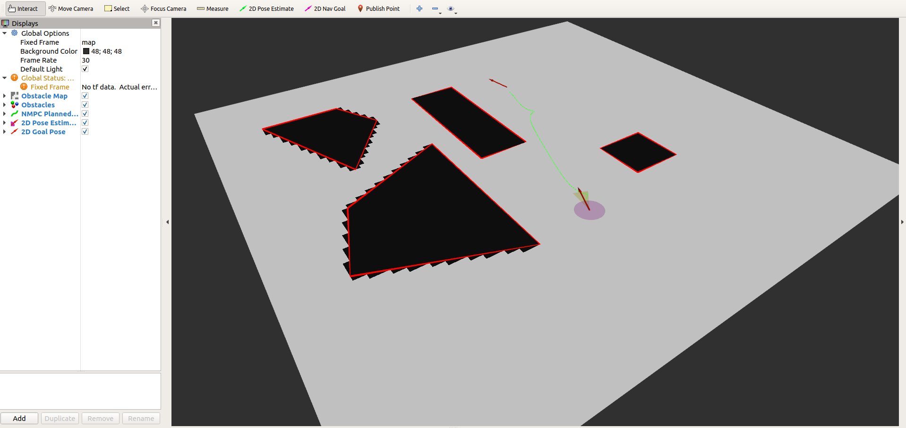

# Nonlinear Model Predictive Control (for planning) tutorial

In this advanced tutorial, we will introduce you to an implementation of
nonlinear model predictive control (NMPC). This tutorial was developed around
the work of Javier Cerna, who implemented the algorithm presented in
["Autonomous Parking Using Optimization-Based Collision Avoidance"](https://ieeexplore.ieee.org/abstract/document/8619433?casa_token=ucsjm_yAuYwAAAAA:z2aOWGgeAMVmnDCxZEKl1fvfMKCMqqA9bfroQkBJNuEFaPUyFGshMGMeRkLJcIV8TVN1xEn0yQ).
We have provided a sample of this implementation in this repository under the
`svea_starter/src/mpc_ca` directory.

**Note, the purpose of this tutorial is to show an example of a complete and
fairly extensive implementation of NMPC. The NMPC path planner will NOT suffice
as a planner for real-time driving out-of-the-box. To use it, you will need to
develop it further. Moreover, we do not take responsibilty for debugging issuse
that may arise while using this for driving, since this is only provided as a
reference point.**

For details about this NMPC formulation for collision avoidance, start with the
paper ["Autonomous Parking Using Optimization-Based Collision Avoidance"](https://ieeexplore.ieee.org/abstract/document/8619433?casa_token=ucsjm_yAuYwAAAAA:z2aOWGgeAMVmnDCxZEKl1fvfMKCMqqA9bfroQkBJNuEFaPUyFGshMGMeRkLJcIV8TVN1xEn0yQ).
If you are interested in an extensive report of the technical details of this
formulation, look through ["Optimization-Based Collision Avoidance"](https://ieeexplore.ieee.org/document/9062306).

### Directory Structure
The main script for running this example is `mpc_ca/scripts/run_planner.py`.
This script will instantiate a `Planner` object that is defined in
`mpc_ca/src/planner/main_planner.py`. The reason why there is such a hiearchy of
planners before getting to the NMPC planner is so that if one wants to add an
additional planner to use to, for example, find a warm-start solution to the
NMPC problem, then this structure makes it easy to do so. Finally, in
`mpc_ca/src/planner/mpc.py`, you will find the NMPC implementation.

In addition, there is also an occupancy grid helper class defined in
`mpc_ca/src/map/occupancy_grid.py`.

## Installation

This tutorial assumes you have already installed ROS Melodic a machine running
Ubuntu 18.04. To run the code in this tutorial, you will need to install or
update:
1. casadi
2. numpy

If you recently updated numpy, you do not need to worry about it. To install
casadi, follow the instructions in:

[https://github.com/casadi/casadi/wiki/InstallationInstructions](https://github.com/casadi/casadi/wiki/InstallationInstructions)

For many users, you should be able to install casadi with `pip install casadi`.
However, your system may require other installation approaches.

If you need to build casadi from source (as opposed to using `pip`), or casadi
does not come with the Ipopt solver, then you will need to make sure to install
Ipopt. If had to build casadi from source, you can install Ipopt by following
the instructions [here](https://github.com/casadi/casadi/wiki/InstallationLinux#installing-ipopt-recommended-if-you-plan-to-solve-optimal-control-problems)

## Running the planner

After you have installed casadi and built your workspace (i.e. `catkin build`,
and so on), you can run the sandbox example we have provided by running:

```bash
roslaunch mpc_ca planner.launch
```

You should expect to see something like this:



Now you can start playing with the solver! You can set an initial pose for the
vehicle with the "2D Pose Estimate" button and a goal pose with the "2D Nav
Goal" button. After creating an inital and goal pose, the NMPC algorithm with
plan a path between them. You'll notice that in some cases, the request might be
infeasible, or the solver might converge on a quirky path. When looking at the
paths, do not forget to consider that the vehicle model can drive backwards and
to check the constrains of the NMPC problem to see if you can understand why the
path might have been proposed.

Additionally to playing with the planner in real-time, you can also try
adjusting different paramaters of the planner and see how it affects the planned
path or even the planning time. You can find the parameters in
`mpc_ca/config/planner.yaml`.
